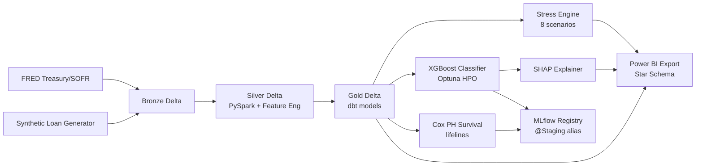

# CRE Refinancing Distress Early-Warning System

**A medallion-architecture data platform for predicting commercial real estate refinance defaults 24 months before maturity.**

  

---

## The Business Problem

Consider a $50M office loan originated in San Francisco in 2019:

| At Origination (2019) | At Maturity (2026) |
|----------------------|-------------------|
| Cap rate: 5.5% | Cap rate: 8.0% |
| Property value: $70M | Property value: $38M |
| LTV: 71% | LTV: 132% (underwater) |
| Note rate: 3.5% | Refi rate: 6.5% |
| DSCR: 1.45x | DSCR: 0.79x |

This loan cannot refinance. The borrower cannot cover debt service at current rates, and the property is worth less than the debt. The lender faces a maturity default.

**Now multiply this by thousands of loans.** Roughly $1.5 trillion of US commercial real estate debt matures through 2027 — much of it office and retail originated at low rates and tight cap rates. Banks, CMBS bondholders, and special servicers need to identify which loans will fail refinancing **before** maturity, at scale.

This system automates that identification 24 months in advance.

---

## What This System Does

- **Ingests** real market data (FRED Treasury/SOFR) + synthetic CMBS loan portfolio into a Delta Lake medallion architecture
- **Engineers features** snapshotted at T_obs = maturity - 24 months (no leakage from future data)
- **Trains an XGBoost classifier** (AUC 0.92) with Optuna HPO to predict refinancing distress probability
- **Fits a Cox PH survival model** (concordance 0.94) for time-to-distress estimation
- **Runs 8 stress test scenarios** — rate shocks, cap rate expansion, combined severe, office-specific
- **Computes SHAP explanations** per loan — top-5 risk drivers for credit officer drill-through
- **Exports a Power BI star schema** with DAX measures library and 5-page report specifications
- **Ships with SR 11-7 compliant** model risk management documentation (7 sections)
- **Registers models in MLflow** with alias-based versioning (`@Staging`)

---

## Key Results

| Component | Metric | Value |
|-----------|--------|-------|
| **Classifier** | AUC-ROC | 0.9202 |
| | PR-AUC | 0.9765 |
| | Brier Score | 0.1069 |
| | Log Loss | 0.3513 |
| **Survival** | Concordance (test) | 0.9399 |
| **Stress Test** | Baseline distressed | 52.9% |
| | Combined severe | 84.4% (+31.5pp) |
| | UPB at risk increase | $155B → $238B |
| **SHAP** | Top driver | `cap_rate_at_Tobs` |
| **Portfolio** | Synthetic loans | 10,000 |

---

## Architecture



---

## Repo Tour

```
cre-refinancing-distress-warning/
├── config/                    # YAML configs (loan generator, stress scenarios)
├── src/
│   ├── ingestion/             # Bronze: loan generator + market data fetcher
│   ├── transformations/       # Silver: PySpark cleaning + feature engineering
│   ├── models/                # XGBoost classifier + Cox PH survival + features.py
│   ├── stress_testing/        # 8-scenario stress engine + aggregate reporting
│   ├── explainability/        # SHAP computation + per-loan explanations
│   ├── exports/               # Power BI star schema exporter
│   └── utils/                 # Delta writer/reader, YAML parser
├── dbt/                       # dbt project (Silver → Gold SQL models)
├── scripts/                   # Pipeline orchestrator + run_gold + run_dbt.sh
├── tests/                     # 120 unit + integration tests
├── docs/
│   ├── analysis/              # Modeling journey, distress diagnostics, stress results
│   └── model_risk_management/ # SR 11-7 documentation (7 sections + SHAP figures)
├── powerbi/                   # Data model spec, DAX library, page specs, connection guides
├── models/evaluation/         # JSON metrics from classifier + survival training
└── reports/                   # stress_summary.csv
```

---

## Quickstart

```bash
# Clone
git clone https://github.com/lakshithask2024/cre-refinancing-distress-warning.git
cd cre-refinancing-distress-warning

# Environment
conda create -n cre-distress python=3.11 -y && conda activate cre-distress
pip install -e ".[dev]"
# Or: pip install -r requirements.txt

# Set MLflow backend
export MLFLOW_TRACKING_URI="sqlite:///mlflow.db"

# ─── Generate Data ───────────────────────────────────────────────────────────
python -m src.ingestion.synthetic_loan_generator --output data/bronze/loans/ --size 5000
python -m src.ingestion.market_data_fetcher --output data/bronze/market/ --offline
python -m src.transformations.run_silver
python scripts/run_gold_models.py

# ─── Train Models ────────────────────────────────────────────────────────────
python -m src.models.train_cli --experiment-name cre_distress
python -m src.models.survival_cli

# ─── Explainability ──────────────────────────────────────────────────────────
python -m src.explainability.shap_cli

# ─── Stress Testing ──────────────────────────────────────────────────────────
python -m src.stress_testing.stress_cli run-all

# ─── Power BI Export ─────────────────────────────────────────────────────────
python -m src.exports.powerbi_exporter --gold-path data/gold --output data/exports/powerbi/

# ─── Inspect Results ─────────────────────────────────────────────────────────
mlflow ui --backend-store-uri sqlite:///mlflow.db
# Opens at http://localhost:5000
```

Expected runtime: ~5 minutes for data generation + training on a laptop.

---

## SHAP Explainability Figures

### Global Feature Importance


### Feature Effect Summary (Beeswarm)


### Dependence: LTV at Observation


### Dependence: DSCR at Observation


---

## Documentation Map

| Document | Purpose |
|----------|---------|
| [`docs/analysis/modeling_journey.md`](docs/analysis/modeling_journey.md) | v1→v4 iteration history + MLflow hygiene post-v4 |
| [`docs/analysis/distress_tier_diagnostics.md`](docs/analysis/distress_tier_diagnostics.md) | Rule-based vs ML: when to use each |
| [`docs/analysis/stress_test_results.md`](docs/analysis/stress_test_results.md) | 8-scenario stress test results |
| [`docs/model_risk_management/`](docs/model_risk_management/) | SR 11-7 documentation (7 sections) |
| [`powerbi/`](powerbi/) | Data model, DAX measures, page specs, connection guides |
| [`models/evaluation/`](models/evaluation/) | JSON metrics from training runs |

---

## Environment Notes

| Requirement | Version | Notes |
|-------------|---------|-------|
| Python | 3.11 | Required (type hints, match statements) |
| Java | 17+ | Required by PySpark |
| libomp | latest | Required for XGBoost on macOS (`brew install libomp`) |
| MLflow | 3.x | Uses SQLite backend (`sqlite:///mlflow.db`) |
| Power BI Desktop | Latest | Windows-only; report specs enable building the .pbix |

The project uses `pyproject.toml` for dependency management. Install with `pip install -e ".[dev]"` or use the pinned `requirements.txt`.

---

## What I Learned / Would Do Differently

**What was hard:** Label leakage was more subtle than expected. The initial model achieved AUC 1.0 — not because the model was brilliant, but because the label was a deterministic function of the input features. Diagnosing target-definition leakage (vs. direct-feature leakage) required three iterations. Separately, MLflow 3.x's silent transition from stages to aliases broke all model loaders until post-registration artifact-load verification was added.

**What I'd change for production:** For real deployment, I would use a stochastic property value model with comparable sales adjustments rather than deterministic NOI/cap_rate. I would engineer a shared `featurize()` function from day one (rather than retrofitting it after the stress engine couldn't reuse the training pipeline). I would use dbt-core with dbt-databricks and Unity Catalog from the start, not the local SQLite + JSON-lines fallback that was necessary for sandbox development. And I would build the monitoring harness (PSI, KS, rolling AUC) as automated checks in CI rather than documenting them as future work.

---

## License

MIT
