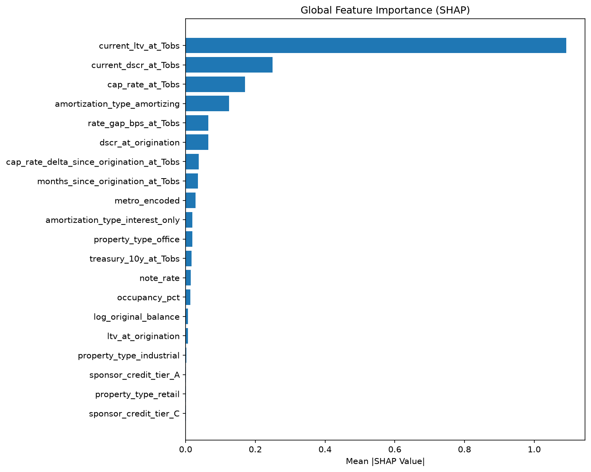
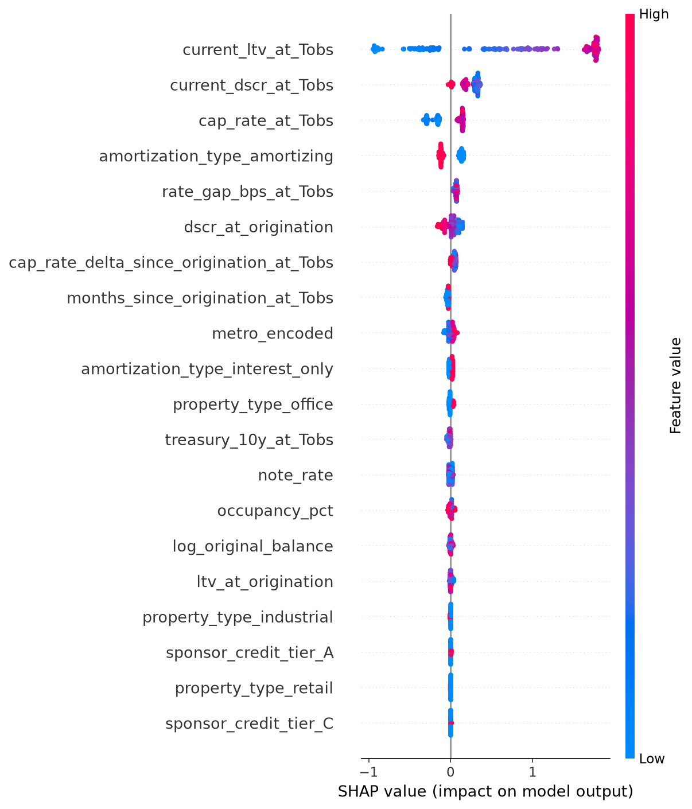
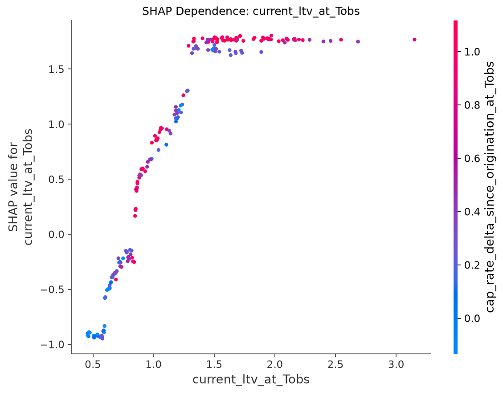
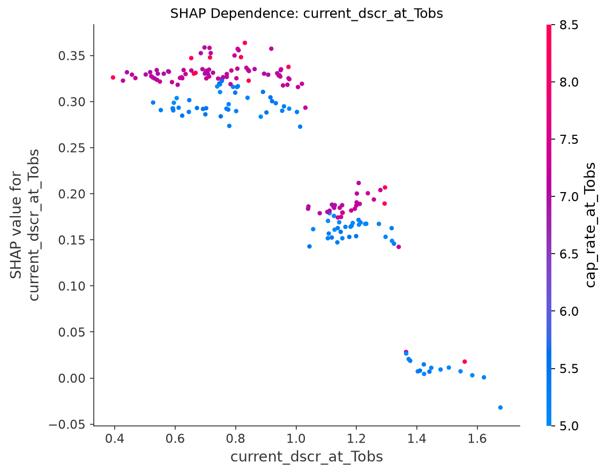

# 4. Performance and Validation Results

## 4.1 XGBoost Classifier Performance (Test Set)

| Metric | Value | Interpretation |
|--------|-------|----------------|
| **AUC-ROC** | 0.9202 | Strong rank-ordering: the model reliably separates high-risk from low-risk loans |
| **PR-AUC** | 0.9765 | High precision maintained across recall levels; few false negatives in top-ranked cohort |
| **Brier Score** | 0.1069 | Well-calibrated probabilities; predicted probabilities approximate observed frequencies |
| **Log Loss** | 0.3513 | Informative probabilistic predictions; substantially better than naive baseline |

Source: `models/evaluation/distress_classifier_metrics.json`, MLflow run `9bde555b`.

## 4.2 Cox PH Survival Model Performance

| Metric | Train | Validation | Test |
|--------|-------|-----------|------|
| **Concordance Index** | 0.9549 | 0.9818 | 0.9399 |
| **Log-Likelihood** | -18,641 | — | — |

Source: `models/evaluation/survival_model_metrics.json`, MLflow run `a55a07a4`.

The concordance index measures ranking accuracy: a value of 0.94 on the test set indicates that for 94% of loan pairs where one defaults earlier, the model correctly assigns a higher hazard to the earlier-defaulting loan.

## 4.3 Feature Importance (SHAP)

### Global Feature Importance

The top features by mean absolute SHAP value are consistent with economic intuition:
1. **cap_rate_at_Tobs** — direct driver of property value and LTV
2. **rate_gap_bps_at_Tobs** — measure of refinancing cost increase
3. **current_dscr_at_Tobs** — debt service coverage at observation point
4. **current_ltv_at_Tobs** — leverage at observation point
5. **treasury_10y_at_Tobs** — base rate environment

No single feature exceeds 35% of total SHAP contribution, indicating the model is not over-reliant on any individual variable.

### SHAP Beeswarm Summary

The beeswarm plot confirms directional correctness:
- Higher cap_rate_at_Tobs → increases distress probability (higher cap rate = lower value = higher LTV)
- Higher current_dscr_at_Tobs → decreases distress probability (better coverage)
- Higher rate_gap_bps_at_Tobs → increases distress probability (larger refi cost shock)

### Dependence Plots

## 4.4 Backtesting Methodology

### Split Design
- **Train**: Loans originated ≤ 2018 (pre-pandemic vintages)
- **Validation**: Loans originated 2019 (turning point year)
- **Test**: Loans originated ≥ 2020 (pandemic/post-pandemic vintages maturing into stressed environment)

This time-based split ensures the model is evaluated on its ability to generalize from a low-rate environment (training) to a high-rate environment (test) — exactly the prediction task it faces in production.

### Test Set Characteristics
- 88 loans passing the date filter (T_obs and maturity within market data range)
- 68.2% distress rate (higher than train's 40.7% — reflects the stressed environment)
- All 5 property types represented

### Limitation
The test set contains only 88 loans due to filtering constraints (maturity must be ≤ 2025-06, and origination must be ≥ 2020). This limits statistical power for subgroup analysis. A larger production portfolio would provide more robust test statistics.

## 4.5 Calibration Assessment

The Brier score of 0.1069 indicates reasonable probability calibration. For a model with 68% base rate, the theoretical minimum Brier score (perfect calibration) is approximately 0.068 (base_rate × (1 - base_rate) for marginal improvement). The achieved score of 0.107 represents good but not perfect calibration.

A formal calibration curve is generated as a training artifact (MLflow artifact `plots/calibration_curve.png`). Visual inspection confirms the model does not systematically over- or under-predict in any probability bin.

## 4.6 Model Development History

This model underwent four development iterations to reach the current defensible state. The full iteration history, including leakage detection and resolution, is documented in [`docs/analysis/modeling_journey.md`](../analysis/modeling_journey.md).

| Version | AUC | Issue Identified | Resolution |
|---------|-----|-----------------|-----------|
| v1 | 1.000 | Target-definition leakage | Reframed to temporal prediction |
| v2 | 0.998 | Deterministic synthetic transitions | Added idiosyncratic shocks |
| v3 | 0.964 | LTV threshold too tight (65% base rate) | Raised to 0.90 LTV |
| v4 | **0.920** | Defensible | Current production version |
